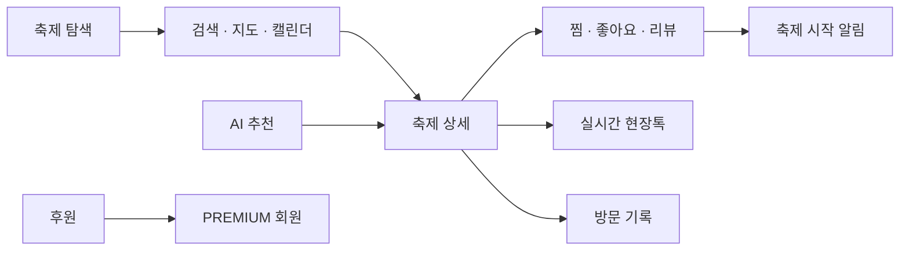
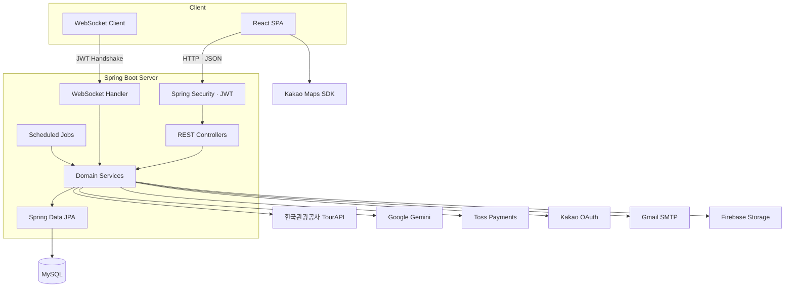
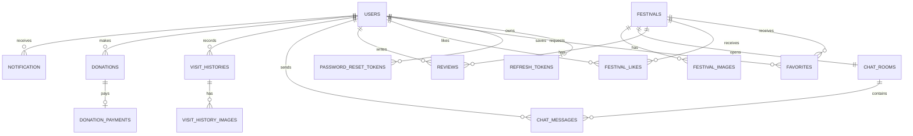

# FestaPick

<div align="center">

### 취향과 지역에 맞는 축제를 발견하고, 현장의 순간까지 함께 나누는 축제 큐레이션 플랫폼

한국관광공사 축제 데이터를 기반으로 검색·지도·캘린더를 제공하고,<br />
AI 추천, 실시간 현장톡, 리뷰, 방문 기록, 후원 기능을 하나의 서비스로 연결했습니다.

[](https://openjdk.org/)
[](https://spring.io/projects/spring-boot)
[](https://react.dev/)
[](https://www.mysql.com/)
[](https://ai.google.dev/)

[GitHub 저장소](https://github.com/human-3rd-project/festapick)

</div>

---

## 목차

1. [프로젝트 소개](#프로젝트-소개)
2. [핵심 기능](#핵심-기능)
3. [서비스 구조](#서비스-구조)
4. [기술 스택](#기술-스택)
5. [프로젝트 구조](#프로젝트-구조)
6. [시작하기](#시작하기)
7. [API 구성](#api-구성)
8. [데이터베이스](#데이터베이스)
9. [핵심 설계와 구현](#핵심-설계와-구현)
10. [테스트](#테스트)
11. [팀원 및 역할](#팀원-및-역할)

---

## 프로젝트 소개

FestaPick은 전국의 축제 정보를 한곳에서 탐색하고, 개인의 관심 지역과 취향에 맞는 축제를 발견할 수 있도록 만든 웹 서비스입니다. 한국관광공사 TourAPI의 축제 데이터를 자체 데이터베이스에 동기화하여 안정적으로 조회하고, 사용자 활동과 실시간 현장 정보를 결합해 단순 정보 검색을 넘어선 축제 경험을 제공합니다.

### 개발 정보

| 구분 | 내용 |
| --- | --- |
| 개발 기간 | 2026.06.04 ~ 2026.06.24 |
| 개발 인원 | 5명 |
| 서비스 형태 | React SPA + Spring Boot REST API |
| 기본 서버 포트 | `8111` |
| 데이터베이스 | MySQL / JPA |
| API 문서 | Springdoc OpenAPI (Swagger UI) |

### 사용자 흐름



---

## 핵심 기능

### 1. 축제 탐색과 검색

- 진행 중인 축제, 월별 축제, 인기 축제와 배너를 메인 화면에 구성
- 키워드·지역·테마·기간을 조합한 통합 검색과 최신순·인기순 정렬
- 법정동 코드와 관광 분류 코드로 사용자 친화적인 지역·테마 필터 제공
- Kakao Map에서 축제 위치와 사용자의 관심 지역 확인
- 월별 캘린더와 찜한 축제 일정 조회

### 2. AI 축제 추천

- 사용자의 자연어 질문과 관심 지역을 바탕으로 Gemini가 축제를 추천
- 데이터베이스의 활성 축제만 후보로 제공하고 최대 3개를 추천
- AI가 반환한 축제 ID를 데이터베이스에서 다시 검증하여 존재하지 않는 축제 노출 방지
- “내 주변”, “근처” 등의 표현을 사용자의 관심 지역 기준으로 해석

### 3. 실시간 현장톡과 AI 현장 요약

- 축제별 WebSocket 채팅방에서 텍스트와 이미지 메시지 공유
- JWT 기반 WebSocket 핸드셰이크와 활성 채팅방 검증
- 채팅 이력 조회 및 현재 접속자 수 표시
- 최근 현장 메시지를 Gemini가 대기열·혼잡도·주의사항 중심으로 요약
- 새 메시지가 있을 때만 AI 요약을 생성해 불필요한 중복 호출 방지

### 4. 회원과 개인화

- 이메일 인증을 포함한 일반 회원가입과 로그인
- Kakao OAuth 로그인 및 신규 소셜 회원 추가 정보 등록
- Access Token 자동 첨부, 401 응답 시 Refresh Token 재발급과 요청 재시도
- 아이디 찾기, 이메일 기반 비밀번호 재설정
- 프로필·비밀번호·관심 지역 수정과 회원 탈퇴

### 5. 축제 활동 기록

- 축제 찜과 좋아요 등록·취소 및 집계
- 별점과 내용이 포함된 리뷰 작성·수정·삭제
- 날짜, 메모, 이미지를 포함한 개인 방문 기록 관리
- Firebase Storage를 이용한 프로필·방문 기록·채팅 이미지 업로드

### 6. 후원과 알림

- Toss Payments SDK로 결제를 요청하고 서버에서 최종 승인
- 주문번호·결제키·금액·결제 상태를 승인 응답과 교차 검증
- 결제 성공·실패 내역과 전체 후원 통계 제공
- 후원 완료 사용자를 `PREMIUM` 역할로 전환
- 찜한 축제의 시작 당일과 2일 전에 알림을 생성하고 읽음 상태 관리

### 7. 관리자 기능

- 회원 검색과 계정 상태 변경
- 리뷰 검색·삭제 및 축제 검색·비활성화
- 완료된 후원 내역과 후원자 정보 조회
- Spring Security에서 `/admin/**` API를 `ADMIN` 역할로 제한

---

## 서비스 구조



### 주요 데이터 흐름

| 흐름 | 처리 방식 |
| --- | --- |
| 축제 데이터 | TourAPI 조회 → `contentId` 중복 검사 → 축제·채팅방 저장 → 외부 이미지 Firebase 이전 |
| AI 추천 | 질문·관심 지역 → 활성 축제 후보 구성 → Gemini → 반환 ID 재검증 → 축제 카드 응답 |
| 현장톡 | JWT WebSocket 연결 → 채팅방별 세션 관리 → 메시지 저장·브로드캐스트 → 주기적 AI 요약 |
| 결제 | 후원 생성 → Toss 결제 요청 → 서버 승인 API 호출 → 금액·주문·상태 검증 → 결제 완료 처리 |
| 알림 | 찜한 축제 일정 조회 → 당일·2일 전 중복 검사 → 알림 저장 → 읽음 처리 |

---

## 기술 스택

### Frontend

| 기술 | 사용 목적 |
| --- | --- |
| React 19 | SPA 화면 및 상태 기반 UI 구성 |
| React Router | 공개·인증·관리자 화면 라우팅 |
| Styled Components | 컴포넌트 단위 스타일링 |
| Axios | REST API 호출, JWT 자동 첨부·재발급 처리 |
| WebSocket API | 축제별 실시간 현장톡 |
| Framer Motion | UI 전환과 인터랙션 |
| Toss Payments SDK | 후원 결제 요청 |
| Kakao Maps SDK | 축제·관심 지역 지도 표시 |

### Backend

| 기술 | 사용 목적 |
| --- | --- |
| Java 17 / Spring Boot 3.5.14 | 서버 애플리케이션과 REST API |
| Spring Data JPA / Hibernate | 도메인 영속성과 검색 쿼리 |
| Spring Security / JWT | Stateless 인증, 역할 기반 API 보호 |
| Spring WebSocket | 실시간 채팅 연결과 메시지 브로드캐스트 |
| Spring WebFlux WebClient | 외부 API 비동기 클라이언트 구성 |
| Spring Scheduler | 축제 동기화, 알림, AI 요약 자동 실행 |
| Spring Mail | 이메일 인증과 비밀번호 재설정 메일 |
| Springdoc OpenAPI | REST API 문서화 |

### Data & External Services

| 기술·서비스 | 사용 목적 |
| --- | --- |
| MySQL | 회원, 축제, 활동, 결제, 알림 데이터 저장 |
| 한국관광공사 TourAPI | 전국 축제·법정동·관광 분류 데이터 |
| Google Gemini 2.5 Flash | 축제 추천과 현장톡 요약 |
| Firebase Storage | 업로드 이미지와 TourAPI 이미지 저장 |
| Kakao OAuth / Maps | 소셜 로그인과 지도 |
| Toss Payments | 후원 결제 요청과 승인 |
| Gmail SMTP | 인증번호와 비밀번호 재설정 메일 발송 |

---

## 프로젝트 구조

```text
festapick/
├── backend/festapick/
│   ├── build.gradle                 # Java·Spring 의존성과 React 통합 빌드
│   └── src/
│       ├── main/java/com/human/festapick/
│       │   ├── config/              # Security, WebSocket, Swagger, 외부 서비스 설정
│       │   ├── constant/            # 역할·상태·메시지 타입 enum
│       │   ├── controller/          # 18개 Controller, 89개 REST endpoint
│       │   ├── dto/                 # 요청·응답 DTO
│       │   ├── entity/              # 18개 JPA Entity
│       │   ├── exception/           # 공통 예외 응답
│       │   ├── repository/          # Spring Data JPA Repository
│       │   ├── security/            # JWT 필터·인증 객체·예외 처리
│       │   └── service/             # 도메인·외부 API·스케줄러 로직
│       ├── main/react/              # Spring 통합 빌드에 사용되는 React 애플리케이션
│       └── main/resources/
│           ├── application.properties
│           └── static/              # 빌드된 React 정적 파일
├── frontend/festa-pick/             # 프론트엔드 별도 개발 작업본
└── README.md
```

> Gradle의 `processResources` 작업은 `backend/festapick/src/main/react`에서 `yarn build`를 실행한 뒤 결과물을 `src/main/resources/static`으로 복사합니다. 통합 실행 시 이 React 소스가 기준입니다.

---

## 시작하기

### 1. 사전 준비

- JDK 17
- MySQL 8.x
- Node.js 및 Yarn
- 외부 서비스 API 키
- Firebase Admin SDK 서비스 계정 JSON

### 2. 저장소 복제

```bash
git clone https://github.com/human-3rd-project/festapick.git
cd festapick/backend/festapick
```

### 3. 데이터베이스 생성

```sql
CREATE DATABASE festapick
  CHARACTER SET utf8mb4
  COLLATE utf8mb4_unicode_ci;
```

기본 연결 정보는 다음과 같습니다.

```properties
spring.datasource.url=jdbc:mysql://localhost:3306/festapick?useUnicode=true&characterEncoding=UTF-8&serverTimezone=Asia/Seoul
spring.datasource.username=root
spring.jpa.hibernate.ddl-auto=update
```

### 4. 백엔드 환경 변수

`backend/festapick/.env` 파일을 생성합니다. 실제 비밀키와 Firebase JSON 파일은 Git에 커밋하지 마세요.

```dotenv
# Database & JWT
SPRING_DATASOURCE_PASSWORD=your_mysql_password
JWT_SECRET=your_base64_encoded_hs512_key

# TourAPI & Gemini
TOUR_API_SERVICE_KEY=your_tour_api_service_key
GEMINI_API_KEY=your_gemini_api_key

# Toss Payments
TOSS_SECRET_KEY=your_toss_secret_key
TOSS_CONFIRM_URL=https://api.tosspayments.com/v1/payments/confirm

# Kakao OAuth
KAKAO_REST_API_KEY=your_kakao_rest_api_key

# Gmail SMTP
MAIL_USERNAME=your_gmail_address
MAIL_PASSWORD=your_gmail_app_password

# Firebase Admin SDK
FIREBASE_PROJECT_ID=your_firebase_project_id
FIREBASE_STORAGE_BUCKET=your-project.firebasestorage.app
FIREBASE_CREDENTIALS_PATH=/absolute/path/to/firebase-service-account.json
FIREBASE_UPLOAD_BASE_PATH=uploads
```

`JWT_SECRET`은 HS512 서명에 사용할 수 있는 충분한 길이의 Base64 키여야 합니다.

### 5. 프론트엔드 환경 변수

통합 빌드 기준 경로인 `backend/festapick/src/main/react/.env`를 생성합니다.

```dotenv
REACT_APP_KAKAO_REST_API_KEY=your_kakao_rest_api_key
REACT_APP_KAKAO_JAVASCRIPT_KEY=your_kakao_javascript_key
REACT_APP_TOSS_CLIENT_KEY=your_toss_client_key
```

외부 서비스 콘솔에는 로컬 주소를 등록해야 합니다.

| 서비스 | 등록할 로컬 주소 |
| --- | --- |
| Kakao OAuth Redirect URI | `http://localhost:8111/oauth/kakao/callback` |
| Kakao Maps Web 도메인 | `http://localhost:8111` |
| Toss 성공 URL | `http://localhost:8111/donation/success` |
| Toss 실패 URL | `http://localhost:8111/donation/fail` |

### 6. 애플리케이션 실행

Linux / macOS:

```bash
bash gradlew bootRun
```

Windows:

```powershell
gradlew.bat bootRun
```

최초 실행 시 Gradle이 React 의존성 설치와 프로덕션 빌드를 함께 수행합니다.

| 주소 | 설명 |
| --- | --- |
| `http://localhost:8111` | FestaPick 웹 서비스 |
| `http://localhost:8111/swagger-ui.html` | Swagger UI |
| `http://localhost:8111/v3/api-docs` | OpenAPI JSON |

### 7. 축제 데이터 동기화

- 서버 시작 시 동기화는 기본적으로 꺼져 있습니다: `tourapi.sync-on-startup=false`
- 서버 실행 중에는 매일 오전 9시(Asia/Seoul)에 오늘 이후 축제를 동기화합니다.
- `contentId`가 이미 존재하는 축제는 다시 저장하지 않습니다.
- 초기 데이터가 필요하면 `tourapi.sync-on-startup=true`로 변경한 뒤 서버를 시작합니다.

---

## API 구성

현재 Controller 선언 기준으로 89개의 REST 엔드포인트를 제공합니다. 전체 요청·응답 스키마는 서버 실행 후 Swagger UI에서 확인할 수 있습니다.

| 도메인 | 기본 경로 | 주요 기능 |
| --- | --- | --- |
| 인증 | `/auth` | 회원가입, 로그인, Kakao 로그인, 토큰 재발급, 로그아웃 |
| 이메일·계정 복구 | `/auth/email-verifications`, `/auth/account` | 이메일 인증, 아이디 찾기, 비밀번호 재설정 |
| 사용자 | `/users/me` | 프로필, 비밀번호, 관심 지역, 회원 탈퇴 |
| 메인 | `/main` | 배너, 주변·월별·인기 축제 |
| 축제 | `/festivals` | 목록, 통합 검색, 지도, 필터, 상세·위치 |
| 활동 | `/festivals/{id}/favorites`, `/festivals/{id}/likes` | 찜·좋아요 등록, 취소, 상태·개수 조회 |
| 리뷰 | `/reviews`, `/festivals/{id}/reviews` | 리뷰 CRUD와 집계 |
| 캘린더 | `/calendar` | 월별·필터·찜 일정 조회 |
| 방문 기록 | `/visit-histories` | 개인 방문 기록 CRUD와 개수 조회 |
| 채팅 | `/chat`, `/ws/chat` | 채팅 이력과 WebSocket 현장톡 |
| AI | `/ai` | 축제 추천, 현장톡 AI 요약 |
| 알림 | `/notifications` | 알림 목록, 미확인 수, 읽음 처리 |
| 이미지 | `/uploads/images` | Firebase 이미지 업로드 |
| 후원 | `/donations` | 후원·결제 승인, 결과, 내역, 통계 |
| 관리자 | `/admin` | 회원·리뷰·축제·후원 관리 |

### 인증 정책

- 축제·메인·캘린더·리뷰 목록·집계 등 탐색 API는 공개됩니다.
- 개인화 데이터 변경, 방문 기록, 이미지 업로드, 후원 등은 JWT 인증이 필요합니다.
- 관리자 API는 `ROLE_ADMIN`만 접근할 수 있습니다.
- Access Token 유효 시간은 1시간, Refresh Token 유효 시간은 7일입니다.
- WebSocket은 `token`과 `chatRoomId` 쿼리 파라미터를 핸드셰이크 단계에서 검증합니다.

---

## 데이터베이스

### 주요 엔티티 관계



### 데이터 모델 구성

| 영역 | 테이블 |
| --- | --- |
| 회원·인증 | `users`, `refresh_tokens`, `email_verifications`, `password_reset_tokens` |
| 축제·코드 | `festivals`, `festival_images`, `festival_category_codes`, `legal_dong_codes` |
| 사용자 활동 | `favorites`, `festival_likes`, `reviews`, `visit_histories`, `visit_history_images` |
| 현장톡 | `chat_rooms`, `chat_messages` |
| 후원 | `donations`, `donation_payments` |
| 알림 | `notification` |

중복 찜·좋아요, TourAPI `contentId`, 결제 주문번호 등 도메인별 고유 제약을 두어 동일 데이터가 반복 생성되는 것을 방지합니다.

---

## 핵심 설계와 구현

### 신뢰할 수 있는 AI 응답

Gemini에게 자유롭게 축제 정보를 생성하게 하지 않고, 데이터베이스의 활성 축제 후보와 ID만 전달합니다. AI 응답의 ID를 다시 조회해 존재 여부와 활성 상태를 검증한 뒤 실제 DB 데이터로 카드를 구성하므로 생성형 AI의 잘못된 정보가 화면에 직접 노출되는 범위를 줄였습니다.

### 외부 데이터의 내부 자산화

TourAPI는 매일 페이지 단위로 조회하고 `contentId`를 기준으로 신규 데이터만 저장합니다. 축제와 채팅방을 함께 생성하며, 외부 이미지도 Firebase Storage로 이전합니다. 이미지 이전에 실패하면 원본 URL을 유지하여 축제 동기화 전체가 중단되지 않게 했습니다.

### 결제 승인 검증

클라이언트의 결제 성공 화면만으로 후원을 완료 처리하지 않습니다. 백엔드가 Toss 승인 API를 직접 호출한 뒤 `paymentKey`, `orderId`, 결제 금액, `DONE` 상태가 모두 일치하는지 검증하고 트랜잭션 안에서 후원과 결제 상태를 갱신합니다.

### Stateless 인증과 권한 경계

비밀번호는 BCrypt로 암호화하고, Spring Security는 서버 세션 없이 JWT 인증을 사용합니다. Refresh Token은 사용자별 하나만 데이터베이스에 보관하며 재발급 시 교체합니다. 공개 API, 로그인 필요 API, 관리자 API를 URL과 역할 기준으로 분리했습니다.

### 중복을 줄인 스케줄 작업

| 작업 | 실행 주기 | 중복 방지 기준 |
| --- | --- | --- |
| TourAPI 축제 동기화 | 매일 09:00 | 축제 `contentId` |
| 찜 축제 시작 알림 | 30분마다 | 사용자·축제·알림 시점 |
| 현장톡 AI 요약 | 30분마다 | 마지막 일반 메시지와 마지막 AI 요약 시간 비교 |

---

## 테스트

### Backend

```bash
cd backend/festapick
bash gradlew test
```

- 인증 서비스의 로그인 성공·실패·정지 회원 처리
- 회원, 축제, 리뷰, 좋아요, 찜, 채팅, 방문 기록 Repository 동작
- Spring 애플리케이션 컨텍스트 로딩

### Frontend

```bash
cd backend/festapick/src/main/react
yarn test
```

- 헤더 알림 목록 문구와 표시
- 전체·개별 읽음 처리
- 알림 클릭 시 상세 화면 이동

### Production build

```bash
cd backend/festapick
bash gradlew clean build
```

이 명령은 백엔드 테스트와 React 프로덕션 빌드, 정적 리소스 통합까지 함께 검증합니다.

---

## 팀원 및 역할

아래 내용은 프로젝트 소스와 Git 커밋 이력에서 확인되는 주요 담당 영역을 기준으로 정리했습니다.

| 팀원 | 주요 담당 영역 |
| --- | --- |
| 박유정 | 프로젝트·UI 통합, JWT/Security, WebSocket, 관리자·후원·알림, Kakao 로그인, 외부 API 설정 |
| 박상현 | 마이페이지·캘린더, 사용자·방문 기록 API, Firebase 이미지 연동, 공통 예외 처리 |
| 홍준희 | 축제 검색·상세·리뷰·현장톡 UI, Main/Festival/Calendar API, 축제 동기화 스케줄러 |
| 이지성 | 로그인·회원가입·계정 찾기 UI/API, 이메일 인증·비밀번호 재설정, 인증 테스트 |
| 임유리 | 메인 화면·헤더·푸터·AI 추천 UI, AI 도메인 Entity/DTO/Service/API 연동 |

---

## 참고 사항

- 외부 API 키, 데이터베이스 비밀번호, JWT 키, Firebase 서비스 계정은 저장소에 공개하지 마세요.
- 운영 환경에서는 Kakao·Toss 콘솔의 Redirect URL과 허용 도메인을 실제 HTTPS 도메인으로 변경해야 합니다.
- `spring.jpa.hibernate.ddl-auto=update`는 개발 편의를 위한 설정입니다. 운영 배포에서는 마이그레이션 도구 사용을 권장합니다.
- Swagger의 제목·설명은 배포 전에 FestaPick 도메인에 맞게 조정할 수 있습니다.
